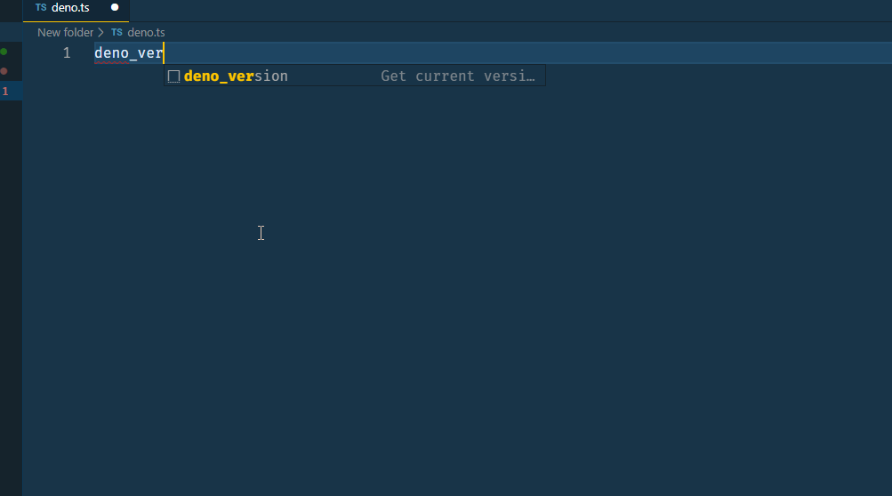

# Deno Standard Library Snippets

Standard library import autocompletions for Deno in VS Code"

## How to use

Type `deno_` + standard library name like `version` while importing to get available autocompletions in work.

## Install instructions

Install via Extension Marketplace

- Search for the Extension `Deno Standard Library Snippets` and install.

## Features

Autocomplete for:

| Added Code   | Number    | Trigger   |
| ------------ | :-------: | :-------: |
| Modules      |    10     | deno_     |

Module triggers:

| Module       | Trigger         |
| ------------ | :-------:       |
| signal       | deno_signal_    |
| uuid         | deno_uuid_      |
| Testing      | deno_testing_   |

## Details

-   License: GPLv3
-   Version: 0.0.5
-   Extension URI: https://github.com/bahiirwa/deno-std-lib-snippets

## Known Issues

Known issues at available at the [Github Repo](https://github.com/bahiirwa/deno-std-lib-snippets/issues)

-----------------------------------------------------------------------------------------------------------

## Release Notes

All notable changes to the "Deno Standard Library Snippets" extension will be documented in here and in the details found in the changelog file.

### 0.0.6 [24.05.2020]

- Add more snippets.
- Descriptions fix, use liners only.
- Fix earlier files with correct module name.

### 0.0.5 [23.05.2020]

- Add more snippets.

### 0.0.4 [23.05.2020]

- Add more snippets.
- Fix descriptions. Descriptions do not support multilines with []. Only double quotes are allowed.

### 0.0.3 [21.05.2020]

- Add more snippets.

### 0.0.2 [21.05.2020]

- Add more snippets.
- Fix .code-snippets file extensions.

### 0.0.1 [21.05.2020]

- Initial release.

**Enjoy!**
